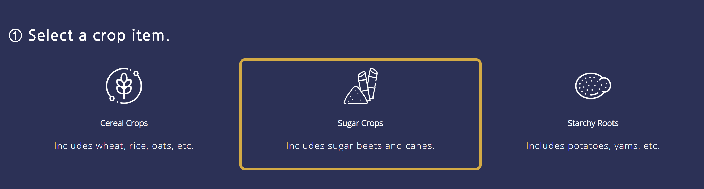

# D3 Visualizations

## Description
For CS 3300 at Cornell University, we created two projects that visualized different data sets using a scatter plot, sankey diagram, and globe. The first project is called Graduate Admissions and the second is World Crop Production.

## Graudate Admissions
The first visualization is called Graduate Admissions. This visualization is broken up into a scatter plot showing the relationship between GPA/test scores and admittance into graduate schools. 

The second part of this visualization was a [Sankey Diagram](https://github.com/d3/d3-sankey). We displayed how GRE and GPA scores affect admission into graduate schools through different paths in the sankey. We do this for three of the nation's top schools: Cornell, Berkeley, and Yale. We made two different sankey graphs for the GRE and GPA attributes. In the example below, we only show the GPA Sankey. 

## World Crop Production
This visualization involved several dynamic components, as opposed to Graduate Admissions which was completely static. In this project, the user picks a crop item, either Cereal, Sugar, or Starchy crops.

Then, the user can pick various countries from a globe. The globe was inspried by an [observable article](https://observablehq.com/@d3/versor-dragging). We used a sequential color scale on the globe to represent land usage. Specifically, green countries have high land usage (~70%) and red countries have low land usage (<10%). There are pause, play, left, and right rotation buttons on the globe. Additionally, there is a year slider which shows the change in land usage dynamically over time. After picking several countries and a crop, we display the countries on a vertical bar graph where the length of the bar corresponds to the percentage of crop production that is wasted

## How to setup
There are no hard dependencies for this project, however a software that is able to serve files will be neeeded. For this purpose, we use python. 

Steps
	1. Download Python  
	2. In Terminal enter `cd Graduate-Admissions' or `cd World-Crop-Production`  
    3. In Terminal enter `python -m http.server`  
    4. Navigate to localhost:5000 in browser  

## Authors
- Frank Rodriguez [@frodr33](https://github.com/frodr33)
- Manish Saha [@sahamanish99](https://github.com/sahamanish99)
- Srishti Belwariar [@srishtibelwariar](https://github.com/srishtibelwariar)
- Nancy Mengel [@nmengel](https://github.com/nmengel)
- Marcela Rey [@marcerey1298](https://github.com/marcerey1298)

