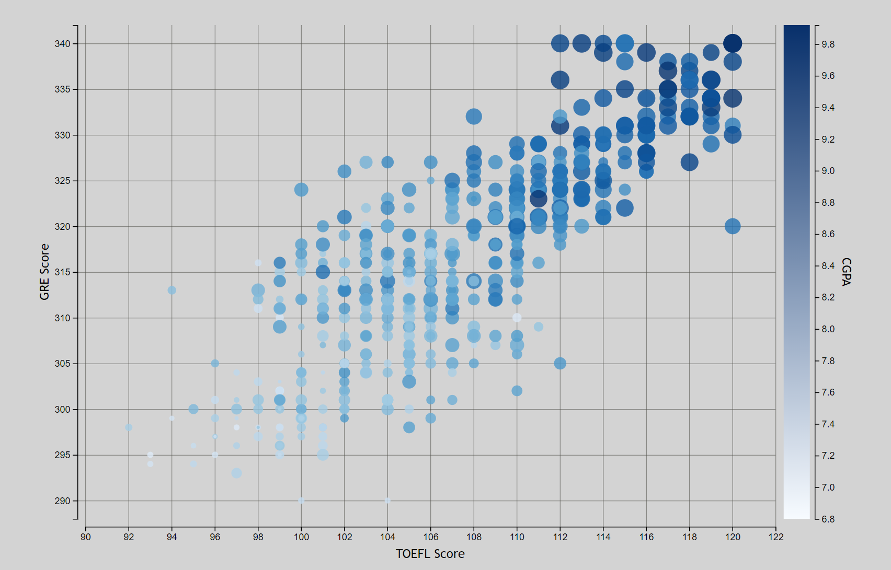
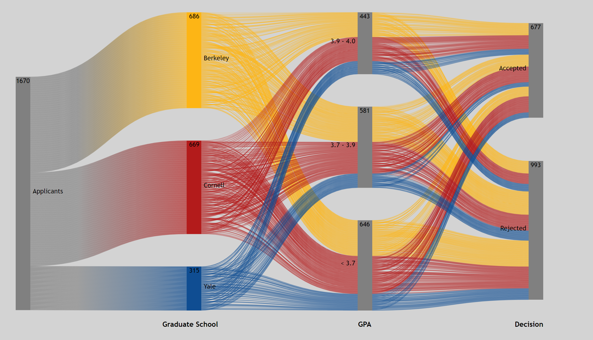
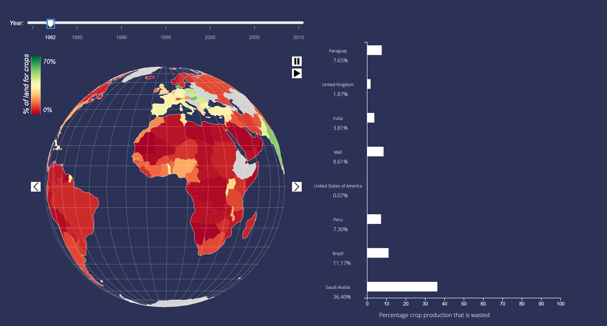

# D3 Visualizations

## Description
For CS 3300 at Cornell University, we created two projects that visualized different data sets using a scatter plot, sankey diagram, and globe. The first project is called Graduate Admissions and the second is World Crop Production.

## Graudate Admissions
The first visualization is called Graduate Admissions. This visualization is broken up into a scatter plot showing the relationship between GPA/test scores and admittance into graduate schools. 

The second part of this visualization was a [Sankey Diagram](https://github.com/d3/d3-sankey). We displayed how GRE and GPA scores affect admission into graduate schools through different paths in the sankey. We do this for three of the nation's top schools: Cornell, Berkeley, and Yale. We made two different sankey graphs for the GRE and GPA attributes. In the example below, we only show the GPA Sankey. 

## World Crop Production
This visualization involved several dynamic components, as opposed to Graduate Admissions which was completely static. In this project, the user picks a crop item, either Cereal, Sugar, or Starchy crops.

Then, the user can pick various countries from a globe. The globe was inspried by an [observable article](https://observablehq.com/@d3/versor-dragging). We used a sequential color scale on the globe to represent land usage. Specifically, green countries have high land usage (~70%) and red countries have low land usage (<10%). There are pause, play, left, and right rotation buttons on the globe. Additionally, there is a year slider which shows the change in land usage dynamically over time. After picking several countries and a crop, we display the countries on a vertical bar graph where the length of the bar corresponds to the percentage of crop production that is wasted

## How to install
OCaml and Opam must be installed prior to installing this project. If OCaml and Opam are not installed then follow the
tutorial at `http://www.cs.cornell.edu/courses/cs3110/2018sp/install.html`

If Ocaml and Opam are installed, then do the following steps:
	1. Clone the repository
	2. Enter `opam install js_of_ocaml js_of_ocaml-ocamlbuild js_of_ocaml-camlp4 js_of_ocaml-lwt` in terminal/command line
	3. In the terminal/command line enter `make`
	4. Click on `index.html` inside the repository directory
	5. A window in your default browser should open and fire-emblem should play automatically! (Click on the screen if nothing is happening)

## How to Play
For best playing experience, use Google Chrome
### Selection
When in the game, you will see various players, enemies, items, and menus. Using 'Z' you can select players to move by pressing on the currently active character. You can tell who the currently active character is by pressing 'A'. 'A' will automatically transfer the cursor over to the currently active character. You can also use 'Z' on enemies to see their range of movement, on menus when you need to select a choice on the menu, and on the ground when you want to end your turn. You can press 'X' to deselect something that has already been selected.

### Movement
When you press 'Z' when the cursor is on a player, an arrangement of blue and red tiles will appear. The blue tiles signify where the current character can move to. Red tiles signify tiles that the player can attack but cannot move to.

### Attacking
After movement, you have the option to attack. If you click on Attack, you will then have to choose an item to attack with. Once you choose an item, red tiles will appear on the map signifying where attacking is possible. If an enemy is on the red tile, simply press 'Z' when the cursor is on that tile. If no enemies are on any red tiles, you must deselect using 'X' and choose another option

## External Dependencies
Oscigen's js_of_ocaml library was used to build the GUI. The library translates Ocaml code to javascript and allows for more advanced GUI abilities than standard Ocaml GUI libraries

## Authors
- Frank Rodriguez [@frodr33](https://github.com/frodr33)
- Albert Tsao
- Darren Tsai
- Ray Gu

## NOTE
Albert Tsao is not included in the statistics for some reason
